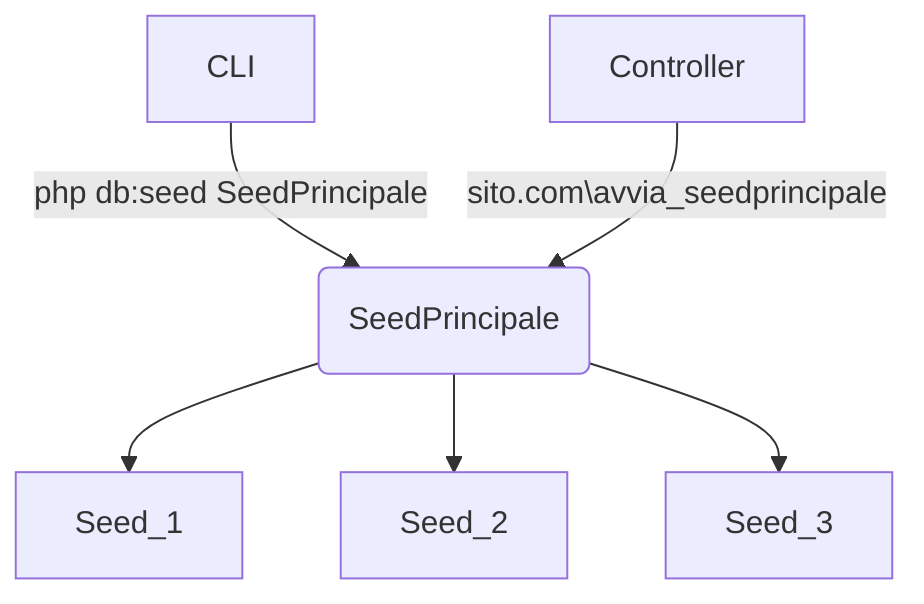

# 5. DATI - SEED E FAKER

> File seeder.
> 
> Libreria Faker
> 
> Seeder multipli

Creaiamo e inseriamo nel database dei dati di test.La libreria Faker ci consente di creare diverse tipologie di dati, da nomi a cifre decimali, da email e username. Per gestire queste funzioni usiamo i seeder: un tipo di file Controller dedicati esclusivamente all'inserimento dei dati in tabella. In un file seed, ad esempio, inseriamo un loop che ad ogni iterazione crea, tramite Faker, un set di dati che tramite i metodi del Model di CI4, vengono inseriti in tabella. 

Solitamente ogni file seeder inserisce i dati in una sola tabella. Quando abbiamo più tabelle, diventa comodo creare un seeder principale che ha la funzione di lanciare tutti gli altri.

Creo un file Seeder da riga di comando:

```shell
php spark make:seeder PopolaLibreria
```

Viene creato il file <mark>app\Database\Seeds\PopolaLibreria.php</mark> con la relativa classe e il metodo run  al cui interno inserirò le istruzioni per inserire i dati.

Adesso, che siamo in fase di test, creo dati fittizzi con la libreria Faker e li inserisco.

esempio di file Seeder con Faker:

```php
<?php
namespace App\Database\Seeds;
use CodeIgniter\Database\Seeder;
use Faker\Factory; // questo va aggiunto 

class PopulateProducts extends Seeder
{
    public function run()
    {
        $faker = Factory::create(); 
        // $faker = Factory::create('it_IT');
        for($i = 0; $i < 100; $i++) {
            $data = [
                'nome'=> $faker->name(),
                'title' => $faker->words(3, true),
                'description' => $faker->words(20, true),
                'price' => $faker->randomFloat(1,0,40)
            ];
           $this->db->table('products')->insert($data);
        }
    }
}
```

Queste sono le tipologie di dati che la libreria può creare:

> [Faker](https://fakerphp.github.io/formatters/numbers-and-strings/)

```php
randomDigit             // tra 0 e 9
randomDigitNot(5)       // tra 0 e 9 tranne 5
randomDigitNotNull      // tra 1 e 9
randomNumber(5, true)   
// true: numeri con 5 cifre
// false: con massimo 5 cifre
randomFloat(2, 0, 50)
// massimo 2 decimali, val minimo 0, val max 50
// senza argomenti: decimale casuale

numberBetween(100, 900) // tra 100 e 900

word()
words(3) // array di 3 parole
words(3, true) // stringa di 3 parole
sentence(4) // frase di 4 parole. default = 6
sentences(5) //array di 5 frasi. default 3. (4, true) stringa
paragraph() e paragrafs()
text(30) //defaoult 200 words

name() email() safeEmail() freeEmail() 
username() password()

Internet, Payment, Color, File ...
```

```shell
php spark db:seed PopolaLibreria
```

## Seed multipli

Se ho più di una tabella, anzichè chiamare singolarmente tutti i seeder posso creare un seeder principale che ha la sola funzione di chiamare in sequenza tutti gli altri.



file di esempio:

```php
<?php
namespace App\Database\Seeds;
use CodeIgniter\Database\Seeder;

class TestSeeder extends Seeder
{
    public function run()
    {
        $this->call('UserSeeder');
        $this->call('CountrySeeder');
        $this->call('JobSeeder');
    }
}
```
