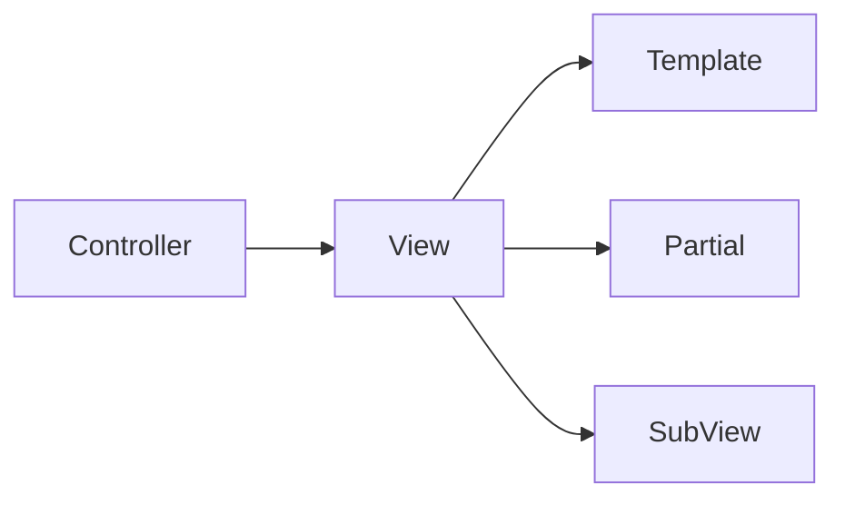

# STRUTTURA DEL LAYOUT

Dopo aver visto una semplice view, passiamo a metodi più flessibili:

Il nostro codice esegue una view e questa estende un template.

La view dopo l'apertura con `$this->extend("template")` conterrà una o più sezioni. Ogni sezione inizia e finisce con i comandi `section('...')` ed `endSection()`.

I metodi sono:

### view

L'uso dell'estensione di un file template è utile per concentrarsi solo sulla parte variabile della pagina. I file css e i file di script possono essere caricati dal Template, se non cambiano mai oppure, in alternativa, possono essere inclusi nelle view, in modo che ognuna carichi quella più opportuna. Una view può caricare un'altra view o un partial.




```php
file app\Views\home.php

<?=$this->extend("template")?>

<?=$this->section("my_section")?>
    [...]
<?=$this->endSection()?> 
```

### template

Il template viene richiamato dalla view tramite il metodo `extend` e colloca il contenuto della view al posto del metodo `renderSection`. Al suo interno può contenere più section, tutte appartenenti alla view che lo ha esteso. Oltre alle view è possibile tramite `include`inserire dei partial (a cui non si possono passare dei dati), come ad esempio header, footer, navbar.

```php
file app\Views\template.php

<?= $this->renderSection("my_section"); ?>
```

### partials

Sono parti di codice inserite tramite la funzione include. Non possono ricevere dati dal file parent.

```php
una view o un template

<?= $this->include('partial') ?>
```


esempi estensivi:

***template.php***

```php
<!DOCTYPE html>
<html>
<head>
  <meta charset="utf-8">
  <meta name="viewport" content="width=device-width, initial-scale=1">
  <title>Hello Bulma!</title>
  <link rel="stylesheet" href="https://cdn.jsdelivr.net/npm/bulma@0.9.3/css/bulma.min.css">
</head>

<body>
  <?= $this->include('template/header') ?>

  <main class="section">

    <?php $this->renderSection('content'); ?>

  </main>

  <?= $this->include('template/footer') ?>
</body>
</html>
```

***header.php***

```php
<header class="section">
    <?= $this->include('template/navbar') ?>
    <h1 class="title">
        Hello World
    </h1>
</header>
```

***footer.php***

```html
<footer class="footer">

    <div>Sito realizzato con Codeigniter 4 + Bulma CSS</div>

</footer>
```

***navbar.php***

```php
<nav class="navbar">
  <div class="navbar-brand">
    <div class="navbar-menu">
      <div class="navbar-start">
        <a class="navbar-item" href="<?= site_url(['register']) ?>">Registrati</a>
        <a class="navbar-item" href="<?= site_url(['login']) ?>">Login</a>
        <a class="navbar-item" href="<?= site_url(['login', 'logout']) ?>">Logout</a>
        <a class="navbar-item" href="<?= site_url(['products']) ?>">Elenco</a>
        <a class="navbar-item" href="<?= site_url(['products', 'add']) ?>">Nuovo</a>
      </div>
    </div>
  </div>
</nav>
```

***app\Views\Prodotti\index.php***

```php
<?php $this->extend('main_template') ?>

<?php $this->section('content'); ?>

<section class="columns is-multiline">

    <?php foreach ($products as $product) : ?>

        <?php echo $item = view('products/card', ['product' => $product]) /* usare load view  j*/ ?>

    <?php endforeach; ?>

</section>

<?php $this->endSection();
```
