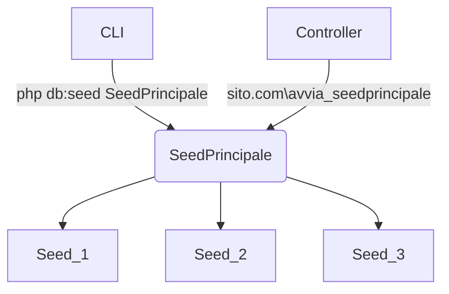

## Seeder

```php
'title' => $faker->words(3, true)
```

Queste sono le tipologie di dati che la libreria può elaborare:

```php
randomDigit             // 7

randomDigitNot(5)       // 0, 1, 2, 3, 4, 6, 7, 8, or 9

randomDigitNotNull      // 5

randomNumber(nbDigits = NULL, strict = false) // 79907610

randomFloat(nbMaxDecimals = NULL, min = 0, $max = NULL) // 48.8932

numberBetween(min = 1000, max = 9000) // 8567

randomLetter            // 'b'

// returns randomly ordered subsequence of a provided array

randomElements(array = array ('a','b','c'), count = 1) // array('c')

randomElement($array = array ('a','b','c')) // 'b'

shuffle('hello, world') // 'rlo,h eoldlw'

shuffle(array(1, 2, 3)) // array(2, 1, 3)

numerify('Hello ###') // 'Hello 609'

lexify('Hello ???') // 'Hello wgt'

bothify('Hello ##??') // 'Hello 42jz'

asciify('Hello ***') // 'Hello R6+'

regexify('[A-Z0-9._%+-]+@[A-Z0-9.-]+.[A-Z]{2,4}'); // [sm0@y8k96a.ej
```

```php
app\Database\Seeds\PopulateProducts.php

<?php

namespace App\Database\Seeds;

use CodeIgniter\Database\Seeder;

use Faker\Factory;

class PopulateProducts extends Seeder
{
    public function run()
    {
        $faker = Factory::create();
        for($i = 0; $i < 100; $i++) {
            $data = [
                'title' => $faker->words(1, true),
                'description' => $faker->words(20, true),
                'price' => $faker->randomFloat(1,0,40)
            ];
           $this->db->table('products')->insert($data);
        }
    }
}
```

Dopo avere creato le tabelle posso avviare i file seed che andranno a creare dei dati fittizzi popolando il db in pochi secondi.

Posso dare il comando tramite CLI:

```shell
php spark db:seed PopulateProducts
```

## Seeder multipli

Se ho più di una tabella, anzichè chiamare singolarmente tutti i seeder posso creare un seeder principale che ha la sola funzione di chiamare in sequenza tutti gli altri.


